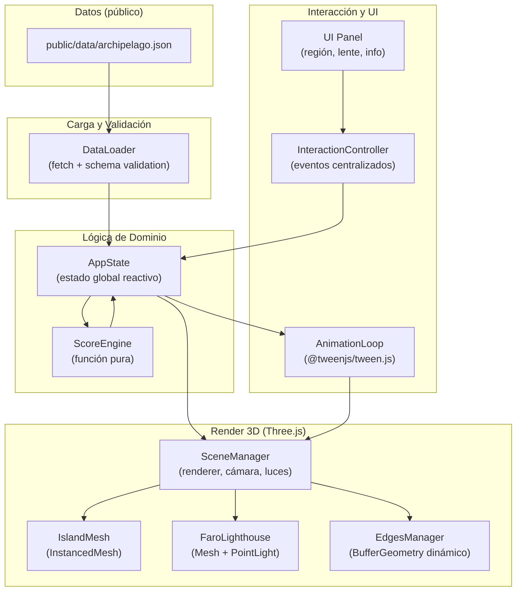
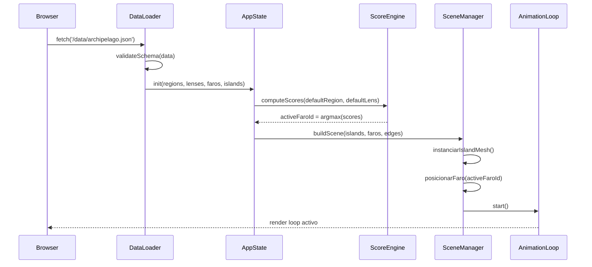
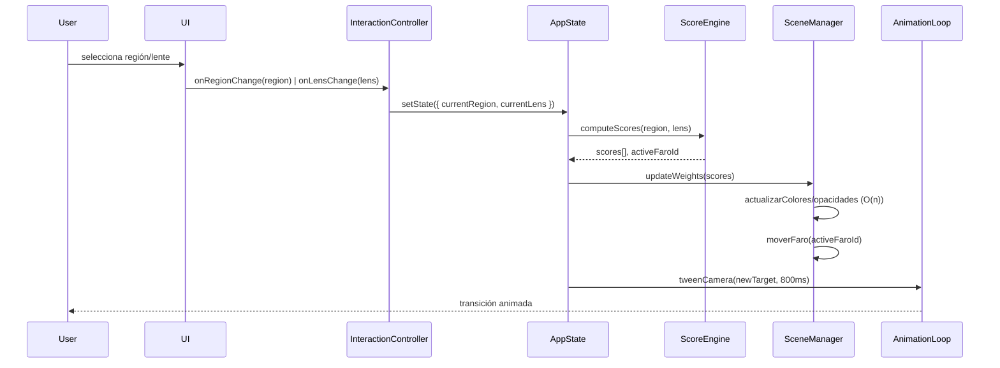
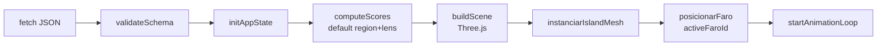
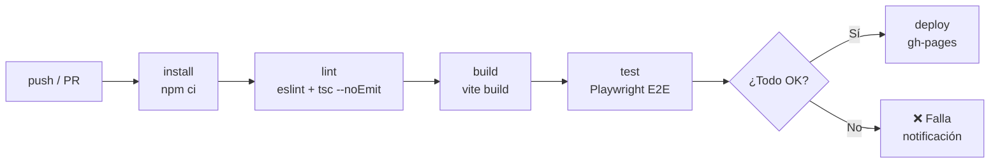

# Documento de Diseño: Archipiélago Estético Interactivo

## Visión General

El **Archipiélago Estético Interactivo** es una visualización 2D de un grafo interactivo donde las *islas* representan escuelas estéticas (nodos fijos en el espacio) y el *faro* interactivo —el nodo de mayor relevancia calculada— se recalcula dinámicamente según la región geográfica y la lente temática seleccionadas por el usuario. El usuario luego de una introducción está en un mismo mapa que se modifica de manera interactiva cuando juega con diferentes controles.

El principio estructural central es la **ausencia de centro ontológico fijo**: la centralidad no está codificada en los datos sino que emerge de una función de scoring que pondera tres factores (índice h, boost por lente, afinidad por región). El sistema es, por tanto, un motor de proyección dinámica sobre un grafo estático.

La entrega es un sitio estático desplegado en GitHub Pages, con datos externos versionados en JSON y sin dependencia de backend.

---

## Arquitectura de Alto Nivel

### Diagrama de Capas



### Diagrama de Flujo de Inicialización



### Diagrama de Flujo de Actualización (Evento de Usuario)



---

## Componentes y Contratos de Interfaz

### DataLoader

**Propósito**: Cargar el archivo JSON externo, validar su esquema y entregar los datos tipados al estado global.

**Interfaz**:
```typescript
interface DataLoader {
  load(url: string): Promise<ArchipelagoData>
}

interface ArchipelagoData {
  regions: string[]
  lenses: string[]
  faros: Faro[]
  islands: Island[]
  sources: Source[]
}

interface Faro {
  id: string
  hindex: number          // >= 0
  boost: Record<string, number>    // boost[lens] ∈ (0, +∞)
  afinidad: Record<string, number> // afinidad[region] ∈ [0, 1]
}

interface Island {
  id: string
  label: string
  position: [number, number, number]
  faroId?: string         // faro asociado, si aplica
}

interface Source {
  id: string
  label: string
  url?: string
}
```

**Responsabilidades**:
- Realizar `fetch` del JSON desde la URL indicada
- Validar que todos los campos requeridos existen y cumplen restricciones de dominio
- Lanzar `DataValidationError` con mensaje descriptivo si la validación falla
- Retornar datos inmutables tipados

---

### ScoreEngine

**Propósito**: Función pura que calcula el score de cada faro dado un estado de región y lente, y determina el faro activo.

**Interfaz**:
```typescript
interface ScoreEngine {
  computeScores(
    faros: Faro[],
    region: string,
    lens: string
  ): ScoreResult

  getActiveFaro(result: ScoreResult): string // id del faro con score máximo
}

interface ScoreResult {
  scores: Map<string, number> // faroId → score
  activeFaroId: string
}
```

**Responsabilidades**:
- Aplicar la fórmula `score = hindex * boost[lens] * afinidad[region]`
- Retornar `Map<faroId, score>` para todos los faros
- Determinar `activeFaroId = argmax(scores)`
- No mutar ningún argumento de entrada
- Ser determinista: mismos inputs → mismo output

---

### AppState

**Propósito**: Fuente única de verdad del estado de la aplicación. Notifica a los suscriptores ante cambios.

**Interfaz**:
```typescript
interface AppState {
  currentRegion: string
  currentLens: string
  activeFaroId: string | null
  affinityMatrix: Map<string, number>

  setState(partial: Partial<AppState>): void
  subscribe(listener: (state: AppState) => void): () => void
}
```

**Responsabilidades**:
- Mantener el estado global de la aplicación
- Garantizar que `activeFaroId` nunca sea `null` tras la carga inicial
- Notificar a todos los suscriptores registrados ante cualquier cambio
- No contener lógica de negocio (delegar a ScoreEngine)

---

### SceneManager

**Propósito**: Gestionar el ciclo de vida del renderer Three.js, la cámara y las luces.

**Interfaz**:
```typescript
interface SceneManager {
  init(container: HTMLElement): void
  buildScene(data: ArchipelagoData): void
  updateWeights(scores: Map<string, number>): void
  moveFaro(faroId: string): void
  dispose(): void
}
```

**Responsabilidades**:
- Crear y configurar `WebGLRenderer`, `PerspectiveCamera` y luces ambientales
- Delegar la creación de meshes a `IslandMesh`, `FaroLighthouse` y `EdgesManager`
- Ejecutar el loop de render (`requestAnimationFrame`)
- Actualizar posición de cámara vía `AnimationLoop`

---

### IslandMesh

**Propósito**: Renderizar todas las islas como un único `InstancedMesh` para minimizar draw calls.

**Interfaz**:
```typescript
interface IslandMesh {
  build(islands: Island[]): THREE.InstancedMesh
  updateOpacity(scores: Map<string, number>): void
  updateColor(scores: Map<string, number>): void
  getInstanceIndex(islandId: string): number
}
```

**Responsabilidades**:
- Crear un `InstancedMesh` con geometría compartida (esfera o icosaedro)
- Mapear cada isla a un índice de instancia
- Actualizar color y opacidad por instancia según el score normalizado visualmente
- Aplicar culling por umbral de score mínimo

---

### FaroLighthouse

**Propósito**: Representar el faro activo como un mesh destacado con fuente de luz puntual.

**Interfaz**:
```typescript
interface FaroLighthouse {
  build(faro: Faro, position: THREE.Vector3): THREE.Group
  moveTo(position: THREE.Vector3, duration: number): void
  highlight(): void
  dim(): void
}
```

**Responsabilidades**:
- Crear un `THREE.Group` con mesh geométrico y `PointLight`
- Animar el movimiento al nuevo faro activo con tween de 800ms
- Gestionar el estado visual (destacado vs. atenuado)

---

### EdgesManager

**Propósito**: Renderizar las aristas del grafo como geometría dinámica.

**Interfaz**:
```typescript
interface EdgesManager {
  build(islands: Island[], connections: Connection[]): void
  updateWeights(scores: Map<string, number>): void
}

interface Connection {
  sourceId: string
  targetId: string
  weight?: number
}
```

**Responsabilidades**:
- Crear `BufferGeometry` con líneas entre islas conectadas
- Actualizar grosor/opacidad de aristas según scores
- Regenerar solo la geometría mínima necesaria en cada actualización

---

### InteractionController

**Propósito**: Centralizar todos los eventos de usuario y traducirlos a mutaciones de estado.

**Interfaz**:
```typescript
interface InteractionController {
  init(canvas: HTMLCanvasElement, state: AppState): void
  onRegionChange(region: string): void
  onLensChange(lens: string): void
  onHover(event: MouseEvent): void
  onClick(event: MouseEvent): void
  dispose(): void
}
```

**Responsabilidades**:
- Registrar listeners en el canvas y en los controles de UI
- Traducir coordenadas de mouse a raycasting 3D para hover/click
- Actualizar `AppState` sin lógica de render directa
- No mantener estado implícito propio

---

## Modelos de Datos

### ArchipelagoData (JSON externo)

```typescript
// Esquema completo del archivo public/data/archipelago.json
interface ArchipelagoData {
  regions: string[]          // ej: ["Europa", "América Latina", "Asia"]
  lenses: string[]           // ej: ["Formalismo", "Marxismo", "Fenomenología"]
  faros: Faro[]
  islands: Island[]
  sources: Source[]
}

interface Faro {
  id: string                          // identificador único
  hindex: number                      // RESTRICCIÓN: >= 0
  boost: Record<string, number>       // RESTRICCIÓN: boost[lens] ∈ (0, +∞)
  afinidad: Record<string, number>    // RESTRICCIÓN: afinidad[region] ∈ [0, 1]
}

interface Island {
  id: string
  label: string
  position: [number, number, number]  // coordenadas 3D fijas
  faroId?: string
  connections?: string[]              // ids de islas conectadas
}

interface Source {
  id: string
  label: string
  url?: string
}
```

**Reglas de validación**:
- Todo `faro.hindex` debe ser `>= 0`
- Todo valor en `faro.boost` debe ser `> 0`
- Todo valor en `faro.afinidad` debe estar en `[0, 1]`
- Cada `island.faroId` referenciado debe existir en `faros`
- `regions` y `lenses` no pueden estar vacíos

---

### AppState (estado en memoria)

```typescript
type AppState = {
  currentRegion: string
  currentLens: string
  activeFaroId: string | null   // null solo antes de carga inicial
  affinityMatrix: Map<string, number>
}
```

**Invariante**: `activeFaroId !== null` tras la carga inicial exitosa.

---

## Algoritmos Clave con Especificaciones Formales

### ScoreEngine.computeScores()

```typescript
function computeScores(
  faros: Faro[],
  region: string,
  lens: string
): ScoreResult
```

**Precondiciones**:
- `faros` es un array no vacío de objetos `Faro` válidos
- `region` es un string no vacío presente en `ArchipelagoData.regions`
- `lens` es un string no vacío presente en `ArchipelagoData.lenses`
- Para todo `f ∈ faros`: `f.hindex >= 0`, `f.boost[lens] > 0`, `f.afinidad[region] ∈ [0,1]`

**Postcondiciones**:
- Retorna un `ScoreResult` con `scores.size === faros.length`
- Para todo `f ∈ faros`: `scores.get(f.id) === f.hindex * f.boost[lens] * f.afinidad[region]`
- `activeFaroId === argmax(scores)` — el id del faro con score máximo
- Ningún argumento de entrada es mutado
- La función es determinista: mismos inputs producen mismo output

**Invariante de bucle**:
- En cada iteración `i`, todos los faros `[0..i-1]` tienen su score calculado correctamente en el mapa

**Pseudocódigo**:
```typescript
function computeScores(faros, region, lens): ScoreResult {
  const scores = new Map<string, number>()
  let maxScore = -Infinity
  let activeFaroId = faros[0].id

  // INVARIANTE: scores contiene scores correctos para faros[0..i-1]
  for (const faro of faros) {
    const score = faro.hindex
      * (faro.boost[lens] ?? 1)
      * (faro.afinidad[region] ?? 0)
    scores.set(faro.id, score)

    if (score > maxScore) {
      maxScore = score
      activeFaroId = faro.id
    }
  }

  // POSTCONDICIÓN: activeFaroId = argmax(scores)
  return { scores, activeFaroId }
}
```

---

### DataLoader.load()

```typescript
async function load(url: string): Promise<ArchipelagoData>
```

**Precondiciones**:
- `url` es un string no vacío con ruta válida al JSON
- El archivo JSON existe y es accesible

**Postcondiciones**:
- Retorna `ArchipelagoData` completamente validado
- Si la validación falla, lanza `DataValidationError` con mensaje descriptivo
- Los datos retornados son inmutables (Object.freeze en desarrollo)

**Pseudocódigo**:
```typescript
async function load(url: string): Promise<ArchipelagoData> {
  const response = await fetch(url)

  if (!response.ok) {
    throw new NetworkError(`HTTP ${response.status}: ${url}`)
  }

  const raw = await response.json()
  const validated = validateSchema(raw)  // lanza DataValidationError si falla

  return validated
}
```

---

### IslandMesh.updateOpacity()

```typescript
function updateOpacity(scores: Map<string, number>): void
```

**Precondiciones**:
- `scores` contiene un entry por cada isla registrada
- Todos los valores de score son `>= 0`

**Postcondiciones**:
- La opacidad de cada instancia refleja el score relativo al máximo
- Islas con score por debajo del umbral de culling tienen opacidad `0`
- El `InstancedMesh` es marcado como `needsUpdate = true`

**Invariante de bucle**:
- En cada iteración, la instancia procesada tiene su opacidad actualizada correctamente

---

## Pipeline de Render

### Inicialización



### Ciclo de Actualización (O(n))

```mermaid
flowchart LR
    A[Evento UI] --> B[setState\nregion/lens]
    B --> C[computeScores\nO(n)]
    C --> D[updateWeights\nIslandMesh]
    D --> E[moveFaro\ntween 800ms]
    E --> F[tweenCamera\n800ms Cubic.InOut]
    F --> G[render frame]
```

**Complejidad**: O(n) donde n = número de faros. El render es O(1) draw calls gracias a `InstancedMesh`.

---

## Manejo de Errores

### Error de Red

**Condición**: `fetch` falla o retorna status HTTP no-2xx  
**Respuesta**: Mostrar mensaje de error en UI, no inicializar escena  
**Recuperación**: Botón de reintento que vuelve a llamar `DataLoader.load()`

### Error de Validación de Datos

**Condición**: El JSON no cumple el esquema esperado  
**Respuesta**: Lanzar `DataValidationError` con campo y valor inválido  
**Recuperación**: Mostrar mensaje descriptivo; el script Python de validación previene esto en CI

### Error de Región/Lente Inexistente

**Condición**: `computeScores` recibe región o lente no presentes en los datos  
**Respuesta**: Usar valores por defecto (primera región, primera lente)  
**Recuperación**: Log de advertencia; la UI solo expone opciones válidas

### Empate en Score Máximo

**Condición**: Dos o más faros tienen el mismo score máximo  
**Respuesta**: Seleccionar el primero en orden de array (determinista)  
**Recuperación**: No requiere recuperación; comportamiento definido

---

## Estrategia de Testing

### Tests Unitarios (Vitest)

**ScoreEngine** — lógica combinatoria crítica:
- Score correcto para combinación válida de región y lente
- `activeFaroId` es el argmax correcto
- Score es 0 cuando `afinidad[region] === 0`
- Determinismo: mismos inputs → mismo output
- No mutación de inputs

**DataLoader** — validación de esquema:
- Acepta JSON válido
- Rechaza JSON con `hindex < 0`
- Rechaza JSON con `boost[lens] <= 0`
- Rechaza JSON con `afinidad[region]` fuera de `[0, 1]`

### Tests E2E (Playwright)

- Carga inicial: faro activo visible tras fetch del JSON
- Cambio de región: faro se actualiza y cámara anima
- Cambio de lente: faro se actualiza correctamente
- Hover sobre isla: muestra tooltip con información
- Click sobre isla: centra cámara en la isla seleccionada
- Combinaciones válidas de región × lente producen estado consistente

### Propiedades a Verificar

- `∀ region, lens: computeScores(faros, region, lens).activeFaroId ∈ faros.map(f => f.id)`
- `∀ faro: score(faro) >= 0` (dado que todos los factores son no negativos)
- `∀ region, lens: score es monótono en hindex, boost y afinidad`

---

## Consideraciones de Rendimiento

- **InstancedMesh**: todas las islas en un único draw call, independiente de n
- **Culling por umbral**: islas con score < umbral_min tienen opacidad 0 y se excluyen del raycasting
- **Geometría mínima**: `EdgesManager` regenera solo los buffers que cambian
- **Una sola luz dinámica**: `PointLight` en el faro activo; luces ambientales estáticas
- **Tween no acumulativo**: cada animación cancela la anterior antes de iniciar

**Trade-off documentado**: recalcular `BufferGeometry` en cada actualización vs. mantener buffers persistentes con índices de visibilidad. La implementación inicial recalcula; se puede optimizar a buffers persistentes si n > 500 islas.

---

## Consideraciones de Seguridad

- **Sin backend**: el sitio es completamente estático; no hay superficie de ataque de servidor
- **Datos externos**: el JSON se valida estrictamente antes de usarse; no se ejecuta código del JSON
- **Sin autenticación**: la aplicación es pública y de solo lectura
- **CSP**: configurar Content Security Policy en GitHub Pages para restringir fuentes de scripts

---

## Estructura del Repositorio

```
archipielago-estetico/
├── .github/
│   └── workflows/
│       └── deploy.yml          # CI/CD: lint → build → test → deploy
├── public/
│   └── data/
│       └── archipelago.json    # datos versionados
├── src/
│   ├── main.ts                 # punto de entrada
│   ├── constants.ts            # ANIMATION_DURATION, CULL_THRESHOLD, etc.
│   ├── scene/
│   │   └── SceneManager.ts
│   ├── entities/
│   │   ├── IslandMesh.ts
│   │   ├── FaroLighthouse.ts
│   │   └── EdgesManager.ts
│   ├── logic/
│   │   ├── ScoreEngine.ts      # función pura, sin dependencias de render
│   │   ├── AppState.ts
│   │   └── DataLoader.ts
│   ├── ui/
│   │   └── UIPanel.ts
│   ├── interaction/
│   │   └── InteractionController.ts
│   └── utils/
│       └── math.ts
├── tests/
│   ├── unit/
│   │   ├── ScoreEngine.test.ts
│   │   └── DataLoader.test.ts
│   └── e2e/
│       └── archipelago.spec.ts
├── scripts/
│   └── validate_data.py        # validación Python para CI
├── index.html
├── vite.config.ts
├── playwright.config.ts
├── tsconfig.json
├── package.json
└── README.md
```

---

## Pipeline CI/CD



**Condición de despliegue**: build exitoso + todos los tests passing.

---

## Correctness Properties

*Una propiedad es una característica o comportamiento que debe mantenerse verdadero en todas las ejecuciones válidas del sistema — esencialmente, una declaración formal sobre lo que el sistema debe hacer. Las propiedades sirven como puente entre las especificaciones legibles por humanos y las garantías de corrección verificables por máquinas.*

### Property 1: Fórmula de scoring correcta

*Para todo* array de faros válido, región y lente válidos, el score calculado por ScoreEngine para cada faro debe ser exactamente igual a `hindex * boost[lens] * afinidad[region]`.

**Validates: Requirements 2.1**

---

### Property 2: Cardinalidad del ScoreResult

*Para todo* array de faros de tamaño n, el `ScoreResult` retornado por ScoreEngine debe contener exactamente n entradas en el mapa de scores — una por cada faro del array de entrada.

**Validates: Requirements 2.2**

---

### Property 3: Argmax determinista

*Para todo* array de faros, región y lente válidos, el `activeFaroId` retornado por ScoreEngine debe ser siempre el identificador del faro con el score máximo, y llamar a `computeScores` dos veces con los mismos argumentos debe producir siempre el mismo resultado.

**Validates: Requirements 2.3, 2.5**

---

### Property 4: Inmutabilidad de inputs en ScoreEngine

*Para todo* array de faros, región y lente válidos, después de invocar `computeScores`, los argumentos de entrada deben ser idénticos a sus valores originales antes de la llamada.

**Validates: Requirements 2.6**

---

### Property 5: Validación rechaza datos inválidos

*Para todo* objeto JSON que viole cualquier restricción del esquema de `ArchipelagoData` (hindex < 0, boost ≤ 0, afinidad fuera de [0,1], faroId inexistente, campos requeridos ausentes), el DataLoader debe lanzar un `DataValidationError` o `NetworkError` con un mensaje descriptivo.

**Validates: Requirements 1.3, 1.4, 1.5, 1.6, 1.7, 13.1, 13.2**

---

### Property 6: Round-trip de ArchipelagoData

*Para todo* objeto `ArchipelagoData` válido, serializar el objeto a JSON y luego deserializarlo y validarlo mediante el DataLoader debe producir un objeto equivalente al original.

**Validates: Requirements 1.2, 13.5**

---

### Property 7: activeFaroId no null tras inicialización

*Para todo* conjunto de datos `ArchipelagoData` válido con al menos un faro, después de inicializar el AppState con esos datos, el campo `activeFaroId` debe ser distinto de `null`.

**Validates: Requirements 3.2**

---

### Property 8: setState actualiza solo campos especificados

*Para todo* estado del AppState y objeto de actualización parcial, después de invocar `setState`, únicamente los campos presentes en el objeto parcial deben cambiar; los demás campos deben permanecer inalterados.

**Validates: Requirements 3.3**

---

### Property 9: InstancedMesh único para todas las islas

*Para todo* array de islas de tamaño arbitrario, el IslandMesh debe crear exactamente un `InstancedMesh` independientemente del número de islas.

**Validates: Requirements 5.1, 11.1**

---

### Property 10: Opacidad proporcional al score normalizado

*Para todo* mapa de scores con valores no negativos, la opacidad asignada a cada instancia de isla debe ser proporcional al score de esa isla relativo al score máximo del mapa.

**Validates: Requirements 5.2**

---

### Property 11: needsUpdate tras cualquier actualización de IslandMesh

*Para todo* mapa de scores, después de invocar `updateOpacity` o `updateColor` en el IslandMesh, la propiedad `needsUpdate` del `InstancedMesh` debe ser `true`.

**Validates: Requirements 5.4**

---

### Property 12: Índice biyectivo de islas

*Para todo* array de islas, el índice interno del IslandMesh debe ser biyectivo: cada `islandId` mapea a un índice único y cada índice corresponde a exactamente un `islandId`.

**Validates: Requirements 5.5**

---

### Property 13: No acumulación de tweens

*Para toda* secuencia de cambios de faro activo o de cámara, en cualquier momento del tiempo debe haber como máximo un tween activo para el faro y como máximo uno para la cámara.

**Validates: Requirements 6.3, 11.3**

---

### Property 14: Cardinalidad de aristas en EdgesManager

*Para todo* grafo de islas con n conexiones definidas, el EdgesManager debe crear exactamente n líneas en la `BufferGeometry` resultante.

**Validates: Requirements 7.1**

---

### Property 15: Propagación de selección de región y lente

*Para toda* región o lente válida seleccionada por el usuario, el InteractionController debe invocar `AppState.setState` con exactamente el valor seleccionado como `currentRegion` o `currentLens` respectivamente.

**Validates: Requirements 8.1, 8.2**

---

### Property 16: Consistencia entre datos y selectores de UI

*Para todo* conjunto de datos `ArchipelagoData`, el UIPanel debe mostrar en sus selectores exactamente las regiones y lentes presentes en `ArchipelagoData.regions` y `ArchipelagoData.lenses` — ni más ni menos.

**Validates: Requirements 9.1, 9.2**

---

### Property 17: Sincronización del UIPanel con el faro activo

*Para todo* cambio de `activeFaroId` en el AppState, el UIPanel debe actualizar su panel de información para mostrar los datos del faro cuyo id es el nuevo `activeFaroId`.

**Validates: Requirements 9.4**

---

### Property 18: Propagación de mensajes de error al usuario

*Para todo* `DataValidationError` lanzado por el DataLoader, el mensaje descriptivo del error debe aparecer visible en la UI sin truncamiento.

**Validates: Requirements 10.2**

---

### Property 19: Fallback a valores por defecto ante inputs inválidos

*Para toda* región o lente no presente en los datos del archipiélago, el ScoreEngine debe usar la primera región y la primera lente del array respectivo como valores por defecto, produciendo un `ScoreResult` válido.

**Validates: Requirements 10.4**

---

### Property 20: Actualización completa de nodos en SceneManager

*Para todo* mapa de scores actualizado, el SceneManager debe actualizar el color y la opacidad de cada isla registrada — ninguna isla debe quedar sin actualizar.

**Validates: Requirements 4.4**

---

## Dependencias

| Paquete | Versión | Propósito |
|---|---|---|
| `three` | `^0.165.0` | Motor 3D WebGL |
| `@tweenjs/tween.js` | `^23.1.3` | Animaciones con easing |
| `vite` | `^5.3.0` | Bundler y dev server |
| `typescript` | `^5.5.0` | Tipado estático |
| `vitest` | `^1.6.0` | Unit testing |
| `playwright` | `^1.45.0` | Testing E2E |
| `eslint` | `^9.0.0` | Linting |

**Criterio**: minimizar dependencias, maximizar control directo. Sin frameworks de UI.

---

## Extensibilidad

El diseño permite las siguientes extensiones sin cambios estructurales:

- **Múltiples faros activos**: `ScoreEngine` puede retornar top-k en lugar de argmax
- **Clustering dinámico**: añadir capa de agrupación sobre `IslandMesh` sin modificar `ScoreEngine`
- **Métricas alternativas**: reemplazar la fórmula en `ScoreEngine` (PageRank, centralidad de betweenness) sin afectar el resto del sistema
- **Término de entropía/controversia**: extender `Faro` con campo `controversy` y modificar solo `ScoreEngine`

**Limitación estructural documentada**: el modelo no descubre relaciones entre islas; las repondera. El valor epistemológico del sistema depende de la calidad del dataset, no del motor de visualización.
